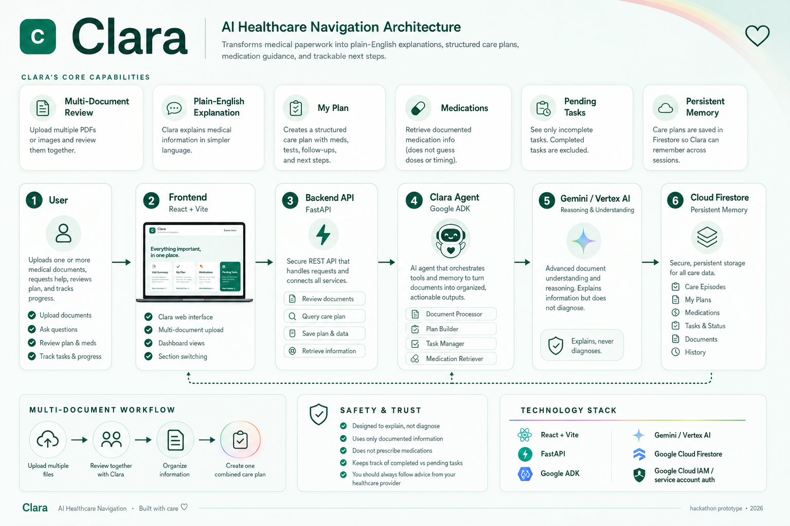

# Clara — AI Healthcare Navigation Agent

Clara is an AI healthcare navigation agent that helps people understand medical paperwork, organize next steps, track care tasks, and maintain a persistent post-visit care plan.

Clara is designed to explain and organize documented medical information — not diagnose conditions or replace a healthcare professional.

## Why Clara Exists

After a medical visit, patients may receive multiple documents containing:

- discharge instructions
- medication directions
- follow-up appointments
- lab orders
- restrictions
- recovery instructions
- provider notes

That information can be difficult to understand and easy to forget.

Clara turns those documents into one clear, actionable care experience.

## Core Capabilities

- Multi-document medical review
- Plain-English medical explanations
- Persistent My Plan
- Medication organization
- Pending task tracking
- Task completion updates
- Firestore persistence across sessions
- Cloud-hosted backend
- Permanently hosted frontend

## Architecture



### High-Level Flow

```text
User
  ↓
Firebase Hosting
  ↓
React + Vite Frontend
  ↓
Google Cloud Run
  ↓
FastAPI Backend
  ↓
Google Agent Development Kit (ADK)
  ↓
Gemini via Vertex AI
  ↓
Google Cloud Firestore
```

## Google Technologies Used

- **Google Agent Development Kit (ADK)** — agent orchestration and tool use
- **Gemini via Vertex AI** — reasoning and multi-document understanding
- **Google Cloud Firestore** — persistent care-plan state
- **Google Cloud Run** — deployed FastAPI backend
- **Firebase Hosting** — deployed React frontend
- **Google Cloud IAM / Service Accounts** — secure service-to-service authentication

## Project Structure

```text
Clara-Agent-
├── clara/                  # Backend + ADK agent
│   └── README.md           # Backend technical documentation
├── frontend/               # React/Vite frontend
│   └── README.md           # Frontend technical documentation
├── assets/
│   └── clara-architecture.png
└── README.md               # Project landing page
```

## Documentation

- [Backend / Clara Agent](clara/README.md)
- [Frontend](frontend/README.md)

## Safety

Clara is an AI healthcare navigation assistant, not a doctor.

Clara does not:

- diagnose medical conditions
- prescribe medications
- replace a healthcare professional
- invent medical instructions
- guess undocumented medication details

Clara is designed to explain and organize information already documented by a patient's healthcare team.

## Current Prototype

The current Clara prototype supports:

- multiple PDF and image uploads
- combined document review
- structured My Plan creation
- medication-specific retrieval
- pending-task filtering
- task completion tracking
- persistent Firestore state
- Cloud Run backend deployment
- Firebase-hosted frontend

## Built For

Google AI Agent Hackathon — 2026
